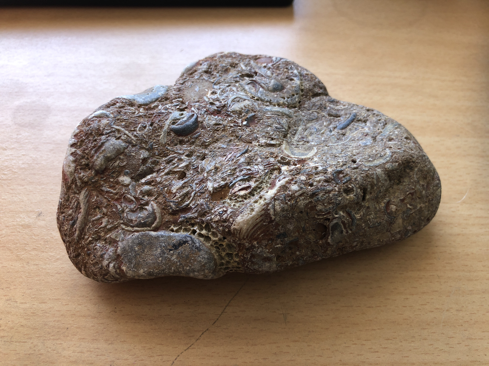

# Fossilized Sea shells-1
This is a fascinating rock that I found at the sea.
 

|       Field | Value                   |
|------------:|-------------------------|
|   **Title** | Fossilized Sea shells-1 |
|     **Key** | ROCK-1 |
| **Created** | 27/Oct/18 7:17 AM |
| **Location Found** | Trafalgar, KWazulu-Natal 30/12/2019 |
| **Rock Type** | Sedimentary |

