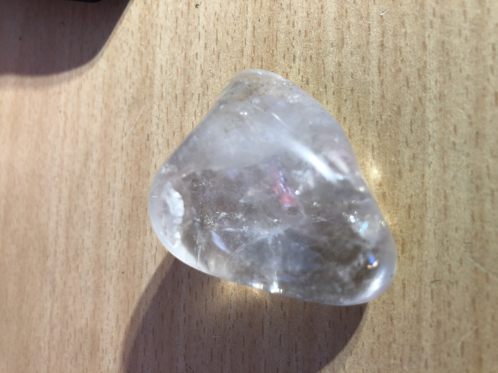

# Polished milky quartz
It has amazing cracks inside the crystal that look like it came from a long time ago. The shape of the rock is just like a heart.
 

|       Field | Value                   |
|------------:|-------------------------|
|   **Title** | Polished milky quartz |
|     **Key** | ROCK-11 |
| **Created** | 27/Oct/18 1:45 PM |
| **Location Found** | Ceres, Worcester and Villiersdorp, Cape town 22/01/2017 |
| **Rock Type** | Metamorphic |

        