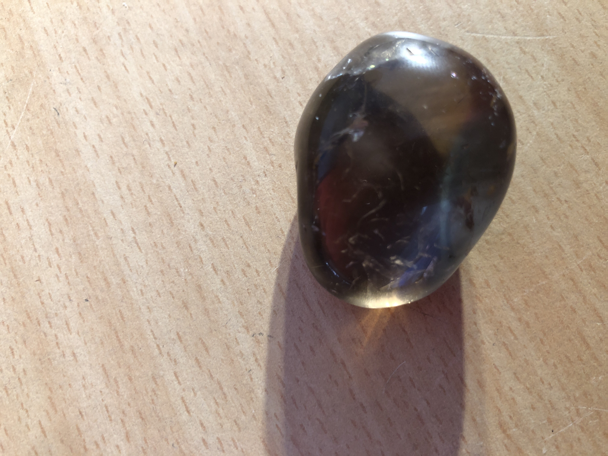

# Polished Smoky quarts
This rock has a big bubble crack with air in it. At night time if you shine a bright light on it will have stars on it.
 

|       Field | Value                   |
|------------:|-------------------------|
|   **Title** | Polished Smoky quarts |
|     **Key** | ROCK-12 |
| **Created** | 27/Oct/18 1:48 PM |
| **Location Found** | Steinkopf, Northern Cape, South Africa. collected 22/01/2022 |
| **Rock Type** | Metamorphic |

        