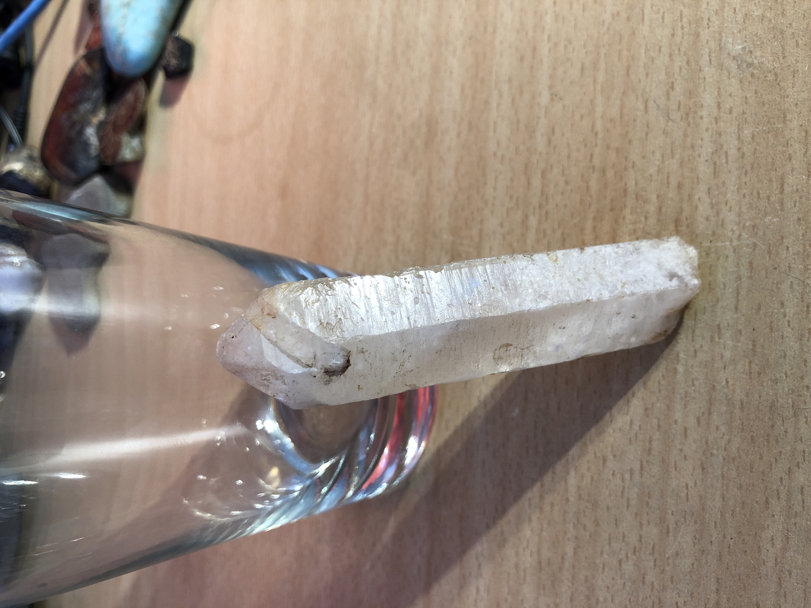

# Long Milky Quartz
This quartz took a long time to grow.
 

|       Field | Value                   |
|------------:|-------------------------|
|   **Title** | Long Milky Quartz |
|     **Key** | ROCK-13 |
| **Created** | 27/Oct/18 1:55 PM |
| **Location Found** | Ceres, Worcester and Villiersdorp, Cape town 22/01/2017 |
| **Rock Type** | Metamorphic |

        