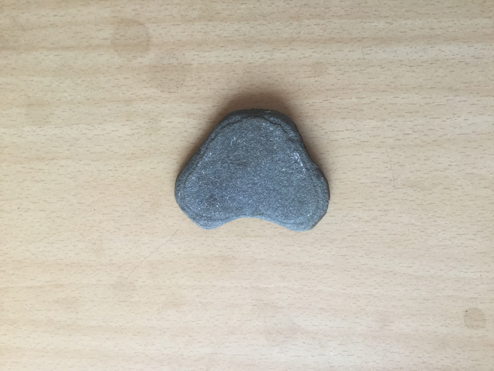
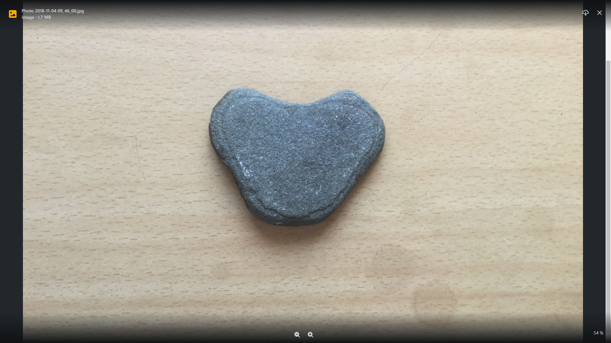

# Sculpted black slate
In the sea it was worn down.

|       Field | Value                   |
|------------:|-------------------------|
|   **Title** | Sculpted black slate |
|     **Key** | ROCK-14 |
| **Created** | 04/Nov/18 9:49 AM |
| **Location Found** | Swartruggens, in the Groot Marico District 10/10/2020 |
| **Rock Type** | metamorphic |

        