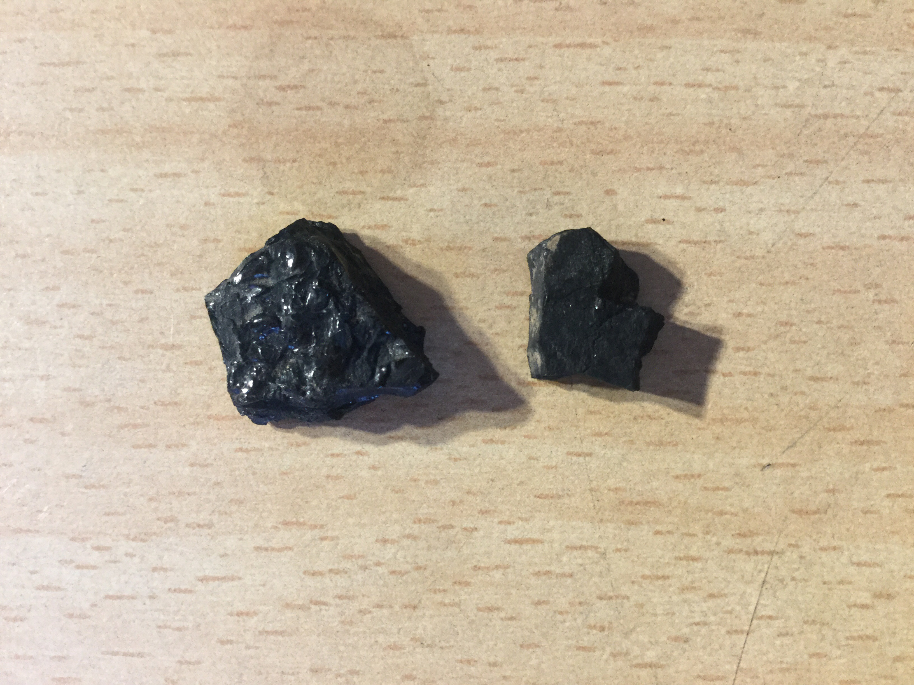
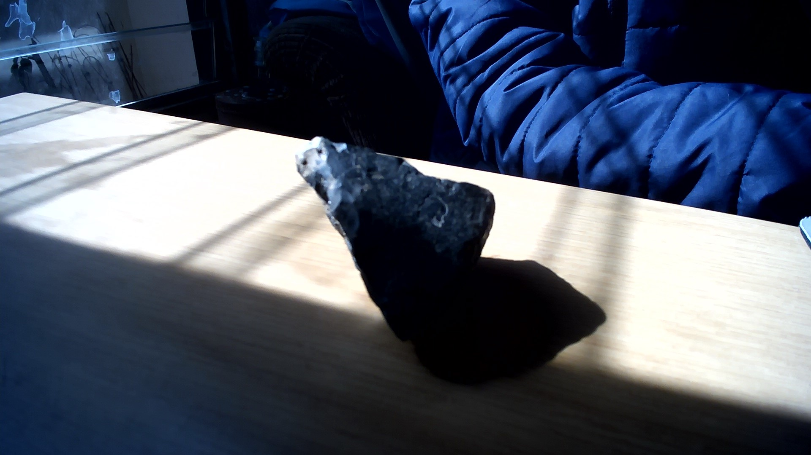

# Bituminous
Millions of years ago this was a plant that has been crushed and compressed by rocks.

|       Field | Value                   |
|------------:|-------------------------|
|   **Title** | Bituminous |
|     **Key** | ROCK-15 |
| **Created** | 04/Nov/18 10:05 AM |
| **Labels** | long, rough, sedementery, semiprecious, wide |
| **Location Found** | Mpumalanga and Northern Province.13/05/2014 |
| **Rock Type** | dense sedimentary rock |

        