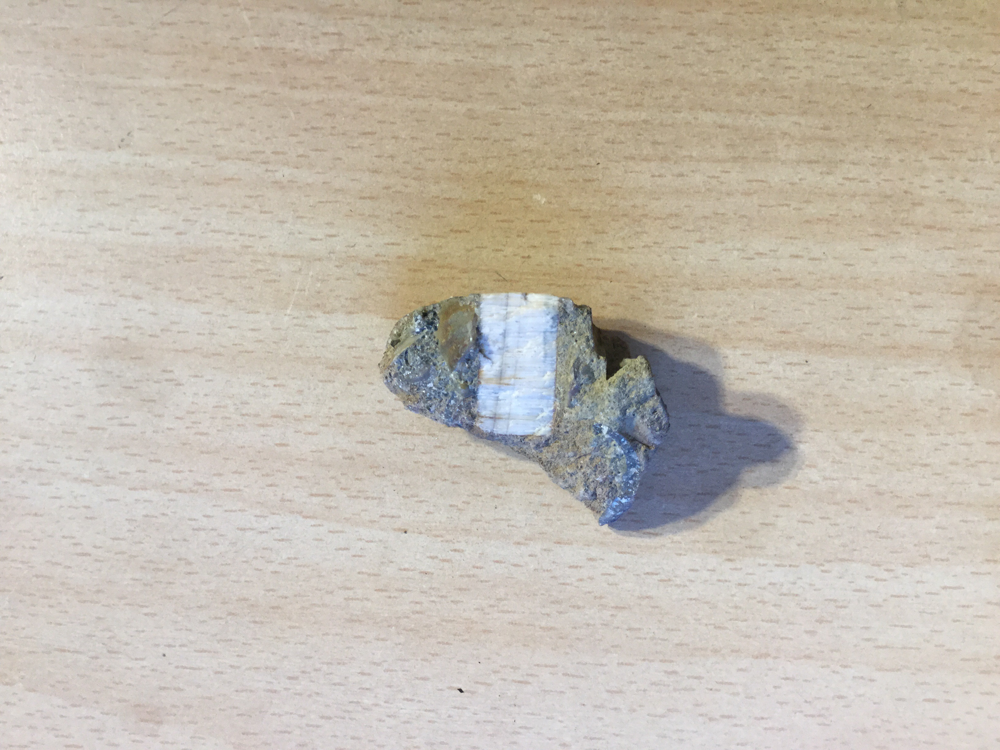

# Fossilized coral
Millions of years ago this  coral was covered in lava and it dried up.

|       Field | Value                   |
|------------:|-------------------------|
|   **Title** | Fossilized coral |
|     **Key** | ROCK-16 |
| **Created** | 04/Nov/18 10:23 AM |
| **Location Found** | Trafalgar, Kwazulu-Natal. ?/12/2017 |
| **Rock Type** | limestone |

        