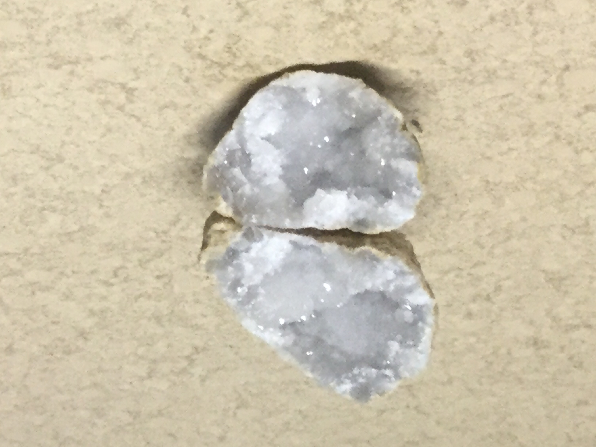

# milky crystalline quartz  Geode
I got it from my mom as a present

|       Field | Value                   |
|------------:|-------------------------|
|   **Title** | milky crystalline quartz  Geode |
|     **Key** | ROCK-18 |
| **Created** | 06/Jun/19 5:50 PM |
| **Labels** | common, crystal, crystallized, geode, pointy, Quarts, rough, round, semiprecious, sharp, shiny, white |
| **Location Found** | Ceres, Worcester and Villiersdorp, Cape town22/01/2018 |
| **Rock Type** | sedimentary |

        