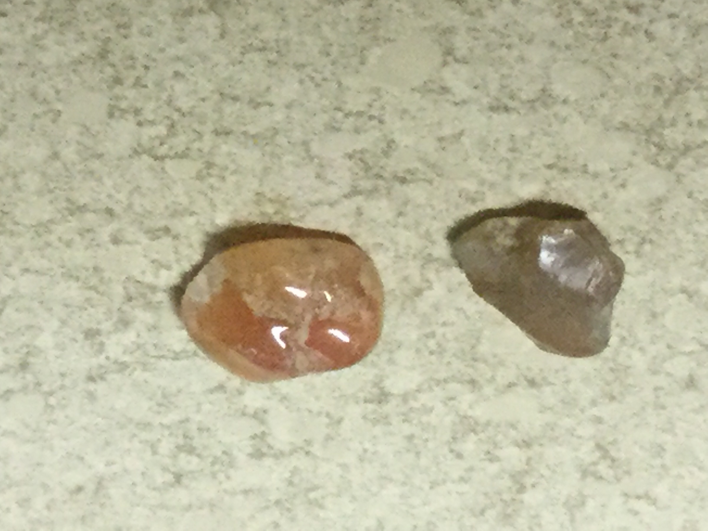
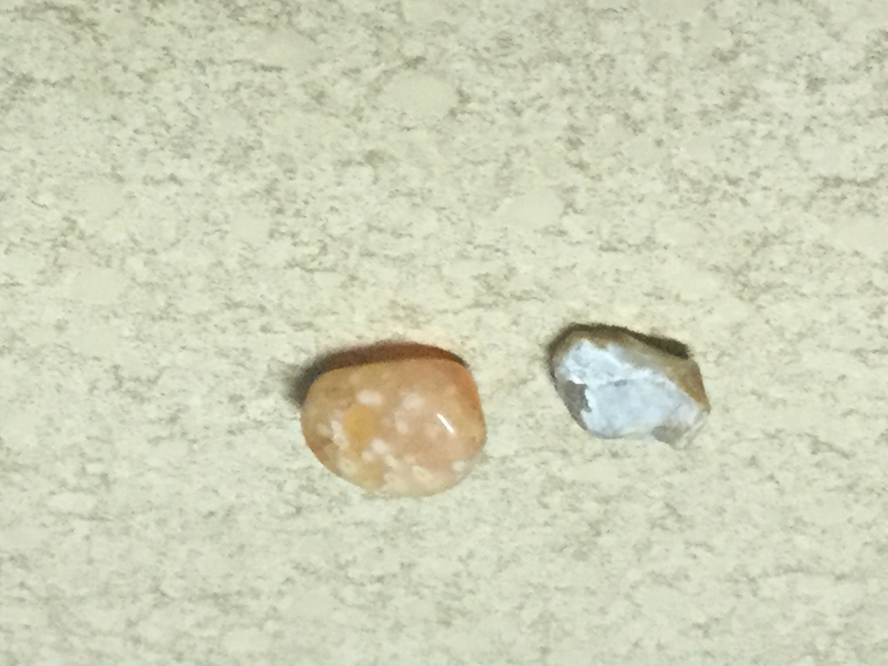

# Citrine
I found these in the sea

|       Field | Value                   |
|------------:|-------------------------|
|   **Title** | Citrine |
|     **Key** | ROCK-19 |
| **Created** | 06/Jun/19 5:59 PM |
| **Location Found** | Trafalgar, KWazulu-Natal ?/12/2019 |
| **Rock Type** | metamorphic |

        