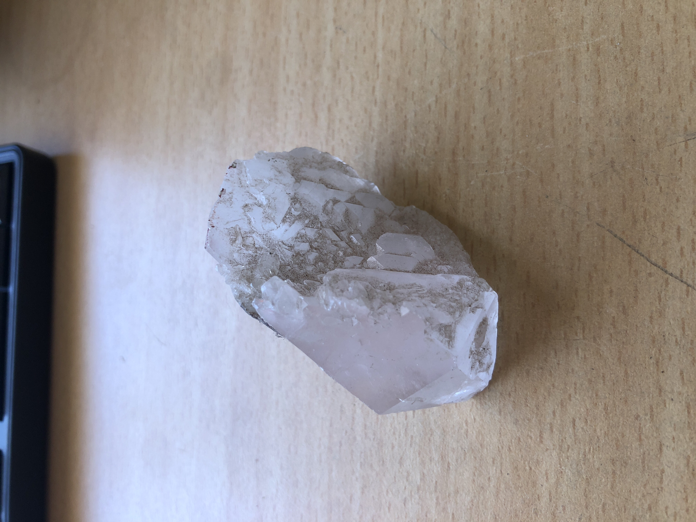
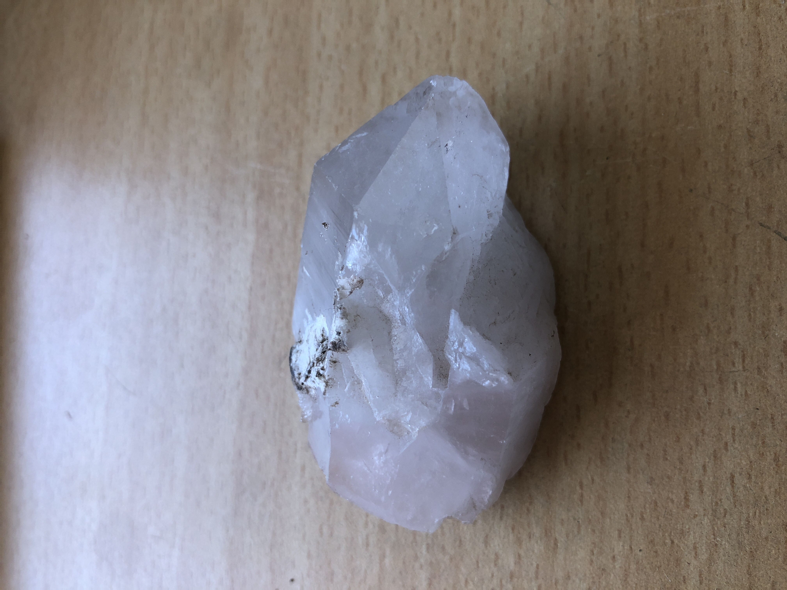
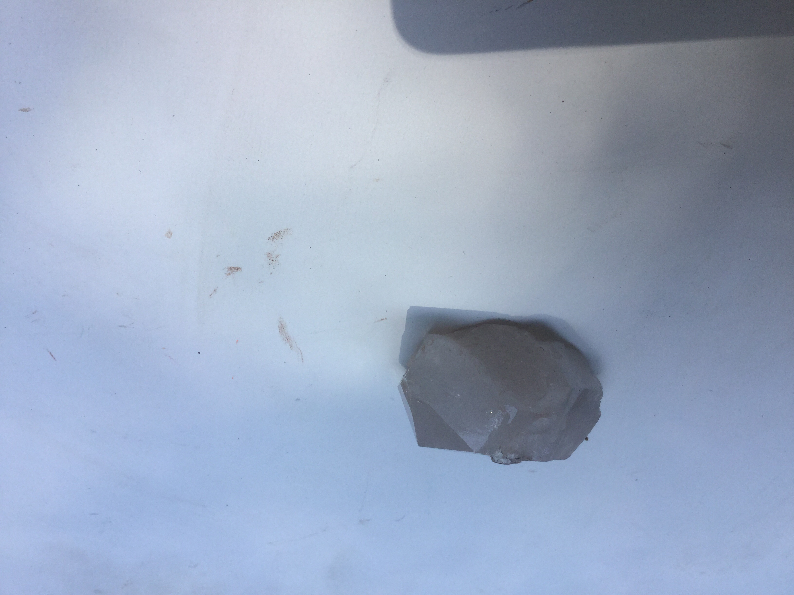

# Big milky Quartz
A Quartz can grow up to 10m.
 

|       Field | Value                   |
|------------:|-------------------------|
|   **Title** | Big milky Quartz |
|     **Key** | ROCK-2 |
| **Created** | 27/Oct/18 8:32 AM |
| **Location Found** | Ceres, Worcester and Villiersdorp, Cape town11/02/2018 |
| **Rock Type** | crystal |

        