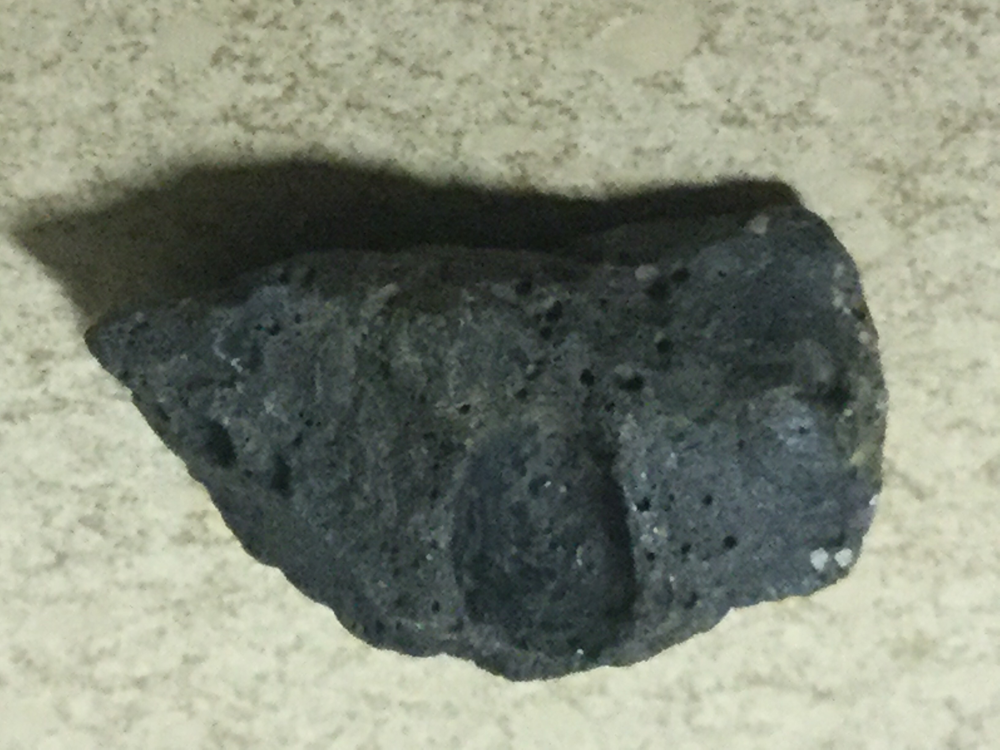
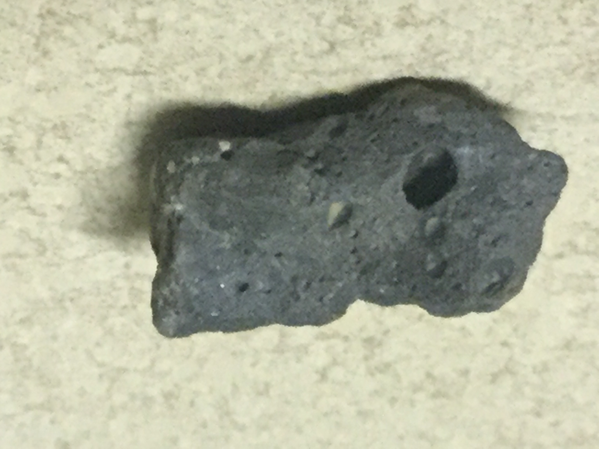
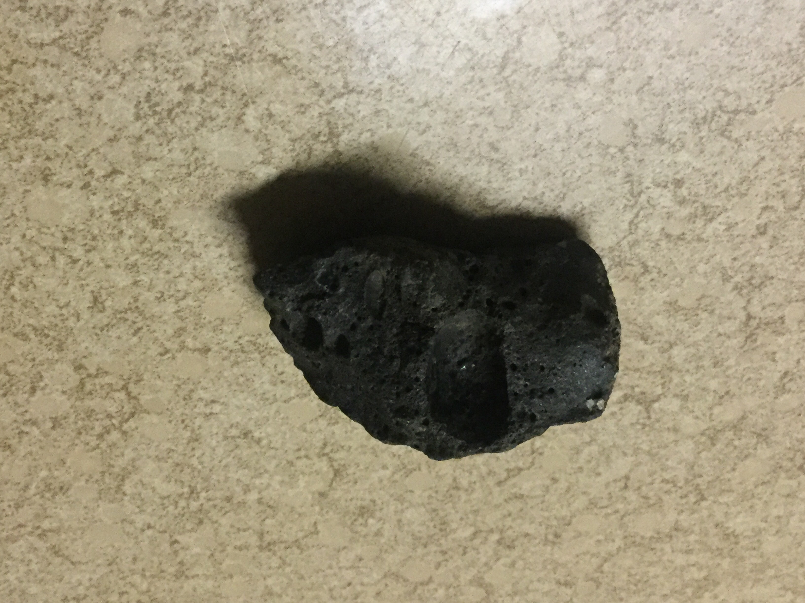

# Vesicular Basalt
I found it on a mountaintop

|       Field | Value                   |
|------------:|-------------------------|
|   **Title** | Vesicular Basalt |
|     **Key** | ROCK-20 |
| **Created** | 06/Jun/19 6:07 PM |
| **Location Found** | Drakensberg. 21/03/2023 |
| **Rock Type** | Igneous |

        