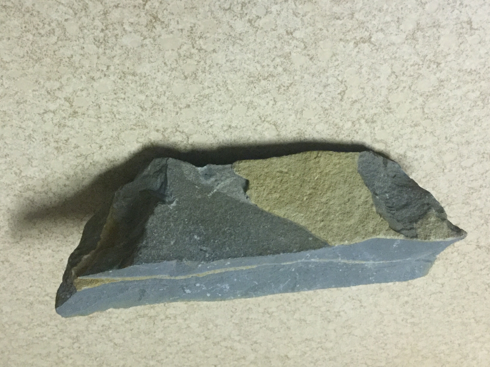

# A lime stone crest inside common slate
I found it on a mountainside

|       Field | Value                   |
|------------:|-------------------------|
|   **Title** | A lime stone crest inside common slate |
|     **Key** | ROCK-21 |
| **Created** | 06/Jun/19 6:12 PM |
| **Labels** | brown, common, grey, pointy, rough, sharp, wide, yellow |
| **Rock Type** | Carbonate Sedimentary and cracked metamorphic |

        