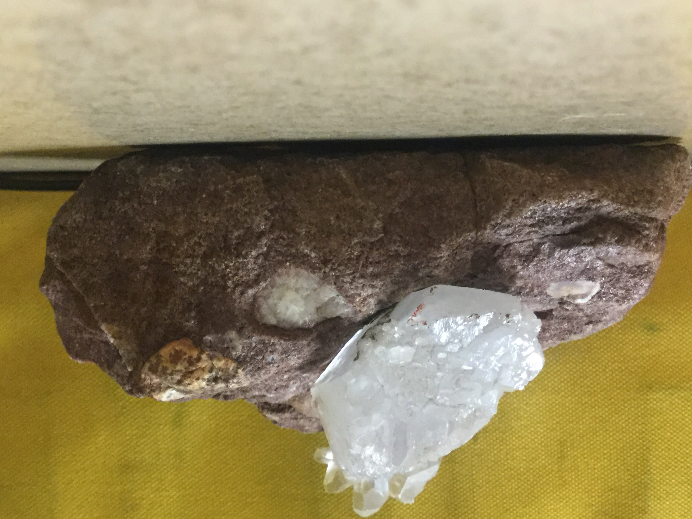
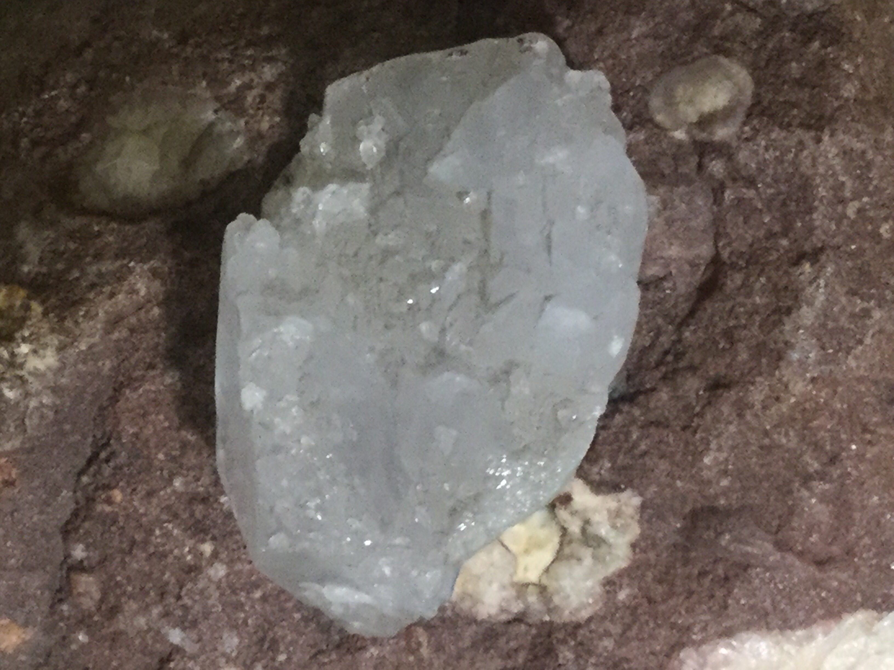
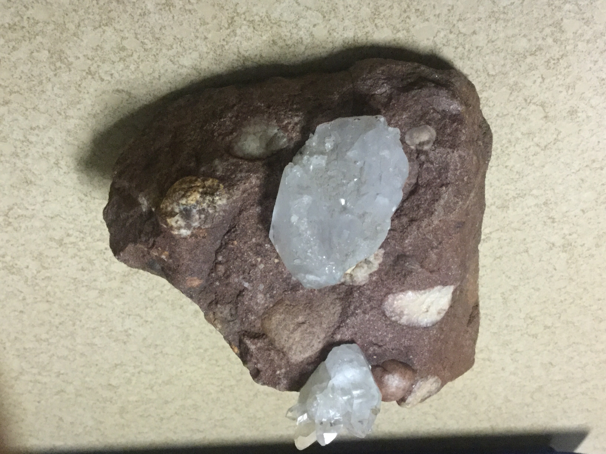
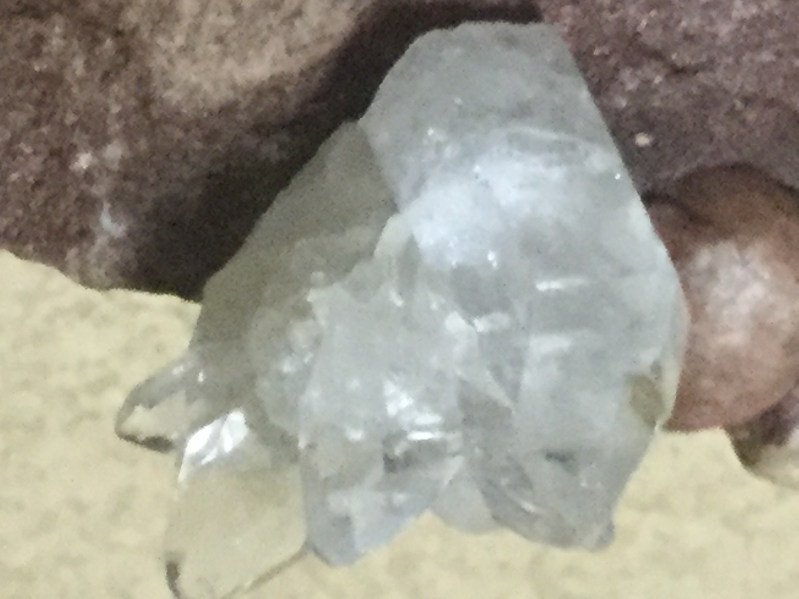

# Quartz inside an iron oxide rock
We found it on a mountaintop

|       Field | Value                   |
|------------:|-------------------------|
|   **Title** | Quartz inside an iron oxide rock |
|     **Key** | ROCK-22 |
| **Created** | 06/Jun/19 6:19 PM |
| **Labels** | crystallized, Quarts, sedementery |
| **Location Found** | On a mountaintop |
| **Rock Type** | Igneous |

        