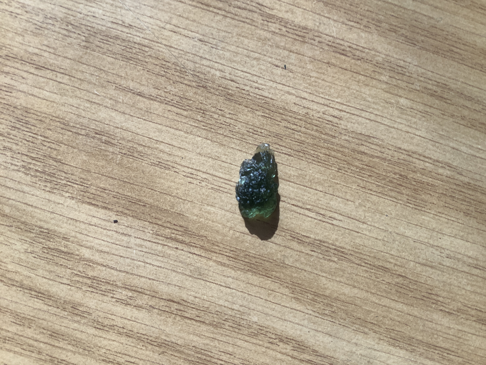

# Moldavite

Moldavite is a forest green, olive green or blue greenish vitreous silica projectile glass formed by a meteorite impact in southern Germany that occurred about 15 million years ago.

|       Field | Value                   |
|------------:|-------------------------|
|   **Title** | Moldavite |
|     **Key** | ROCK-24 |
| **Created** | 20/Jan/21 7:49 AM |
| **Labels** | crystal, green, precious, rare, rough, shiny |
| **Location Found** | Germany |
| **Rock Type** | Gem |

        