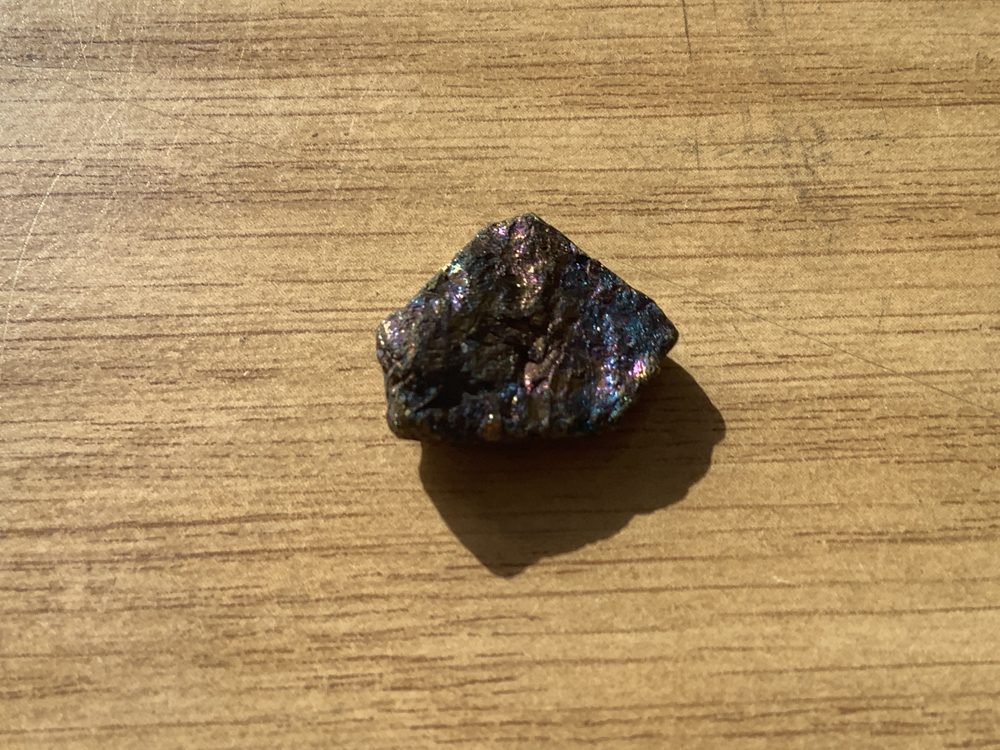

# Peacock ore

|       Field | Value                   |
|------------:|-------------------------|
|   **Title** | Peacock ore |
|     **Key** | ROCK-25 |
| **Created** | 20/Jan/21 8:11 AM |
| **Location Found** | U.S. Bristol, Connecticut |
| **Rock Type** | Igneous,Sedimentary & metamorphic |

        