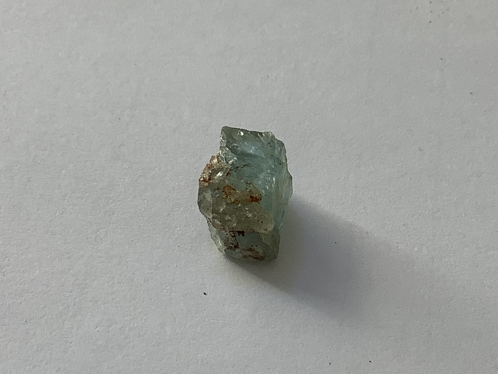
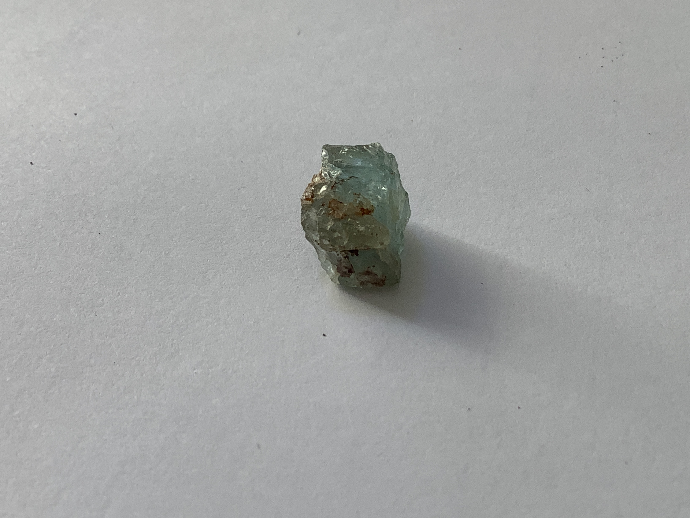

# Aqua marine

|       Field | Value                   |
|------------:|-------------------------|
|   **Title** | Aqua marine |
|     **Key** | ROCK-28 |
| **Created** | 20/Jan/21 8:20 AM |
| **Labels** | blue, crystallized, rough |
| **Location Found** | Columbia, Zambia, Madagascar, Malawi, Tanzania and Kenya |
| **Rock Type** | Metamorphic |

        