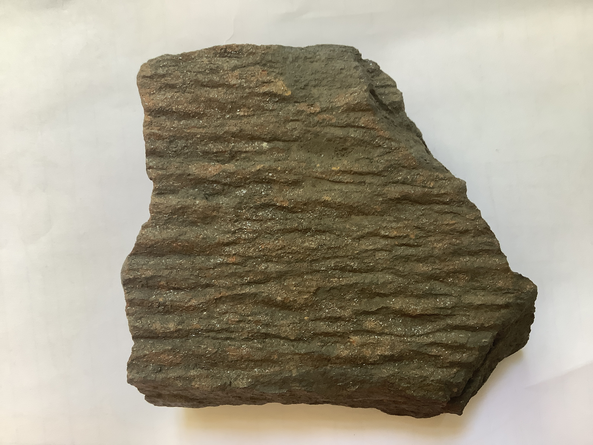

# Fossilized sand ripples

|       Field | Value                   |
|------------:|-------------------------|
|   **Title** | Fossilized sand ripples |
|     **Key** | ROCK-38 |
| **Created** | 21/Jan/21 11:55 AM |
| **Labels** | black, brown, common, fossilized, gold, rough, sedementery, wide |
| **Location Found** | North America South America Europe Africa Asia Australia |
| **Rock Type** | Sedimentary |

        