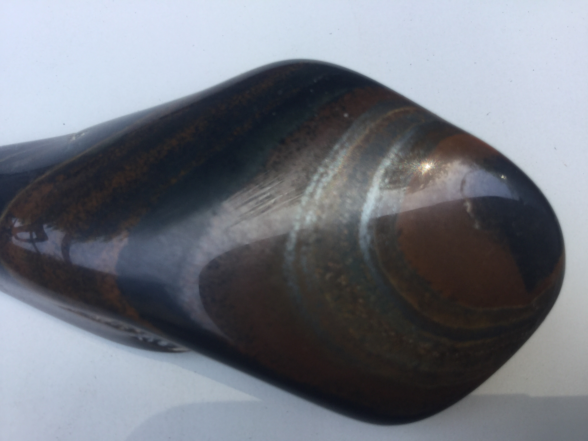
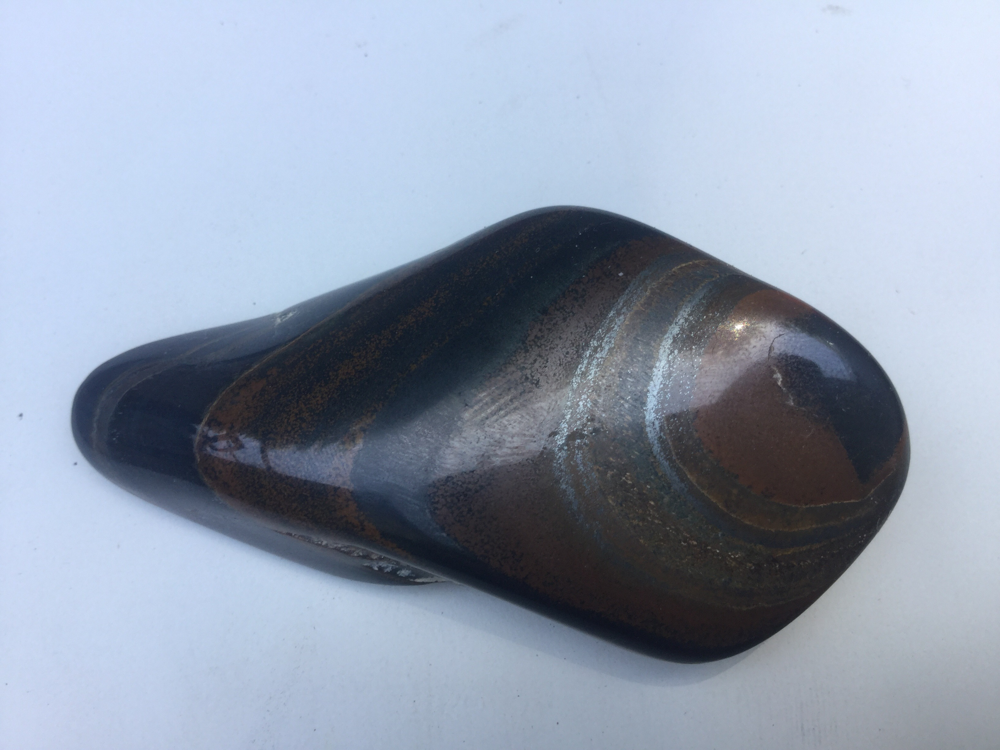
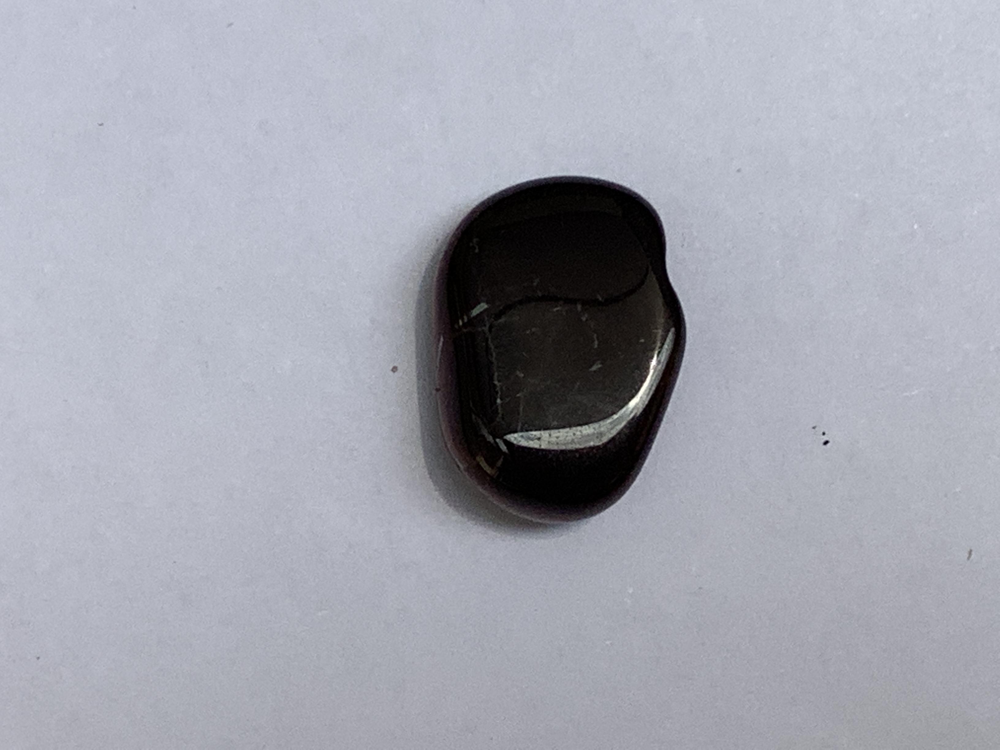
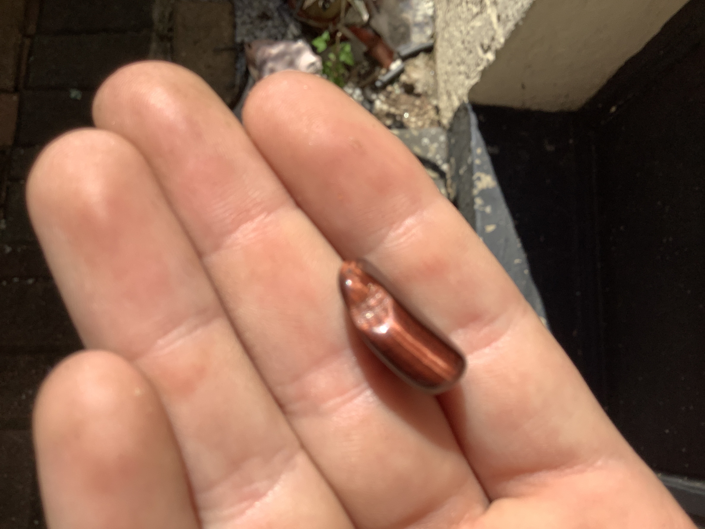

# Red Tigers Eye
It looks like a normal Tigers Eye just it has red stripes on it.

|       Field | Value                   |
|------------:|-------------------------|
|   **Title** | Red Tigers Eye |
|     **Key** | ROCK-4 |
| **Created** | 27/Oct/18 11:21 AM |
| **Labels** | polished, red, semiprecious, shiny |
| **Location Found** | Prieska, Nourthern Cape. collected 23/05 2021 |
| **Rock Type** | Metamorphic |

        