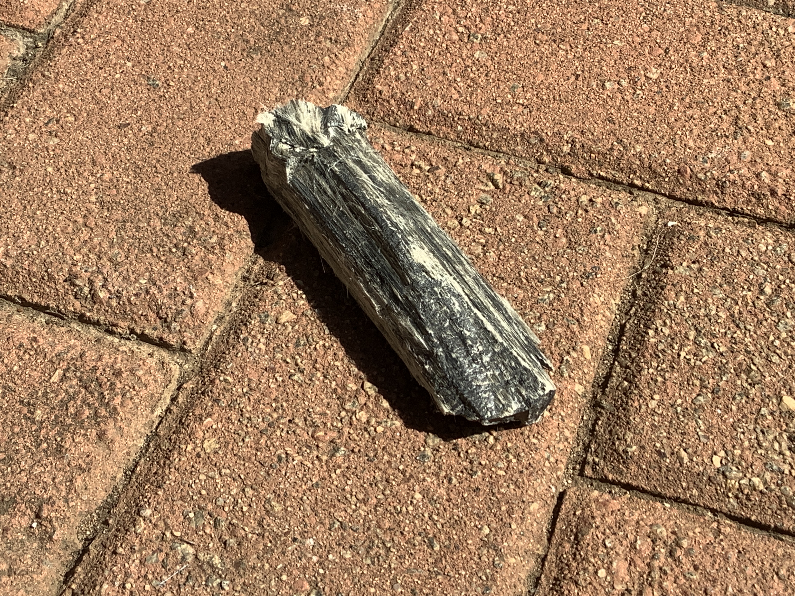

# Crocidolite Asbestos

|       Field | Value                   |
|------------:|-------------------------|
|   **Title** | Crocidolite Asbestos |
|     **Key** | ROCK-42 |
| **Created** | 03/Dec/21 9:27 AM |
| **Labels** | blue, fossilized, furry, semiprecious |
| **Location Found** | South africa, russia asia |
| **Rock Type** | acidic igneous rocks |

        