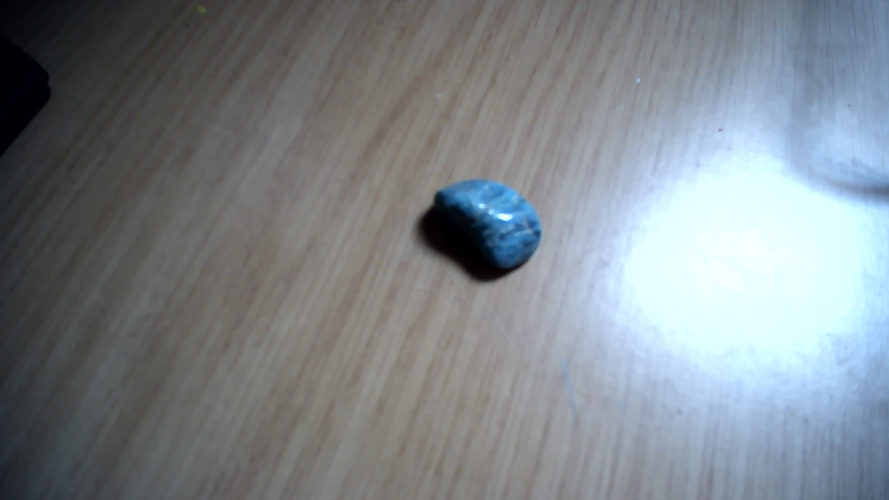

# Sodalite

|       Field | Value                   |
|------------:|-------------------------|
|   **Title** | Sodalite |
|     **Key** | ROCK-48 |
| **Created** | 03/Dec/21 10:41 AM |
| **Labels** | blue, common, crystal, crystallized, polished, round, semiprecious, shiny |
| **Location Found** | Africa, Asia, South America, North America, Astralasia, Indon Asia, brazil |
| **Rock Type** | Metamorphic |

        