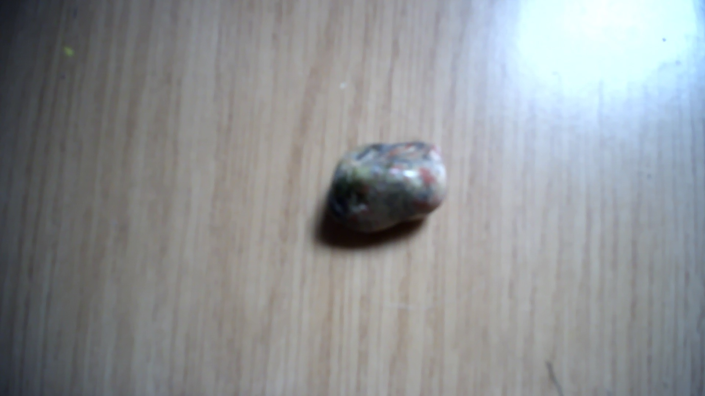
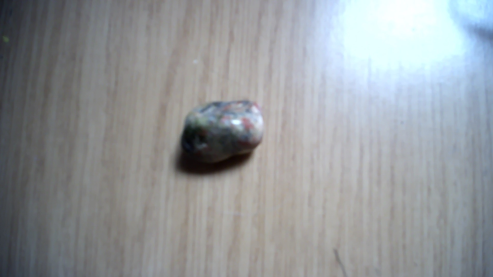

# RainForest Rhyolite

|       Field | Value                   |
|------------:|-------------------------|
|   **Title** | RainForest Rhyolite |
|     **Key** | ROCK-50 |
| **Created** | 03/Dec/21 11:04 AM |
| **Labels** | colourfull, common, irregular, organic, sculpted, smooth |
| **Location Found** | Mount Hay, Wycarbah, Rockhampton Region in Queensland, Australia. |
| **Rock Type** | extrusive igneous rock |

        