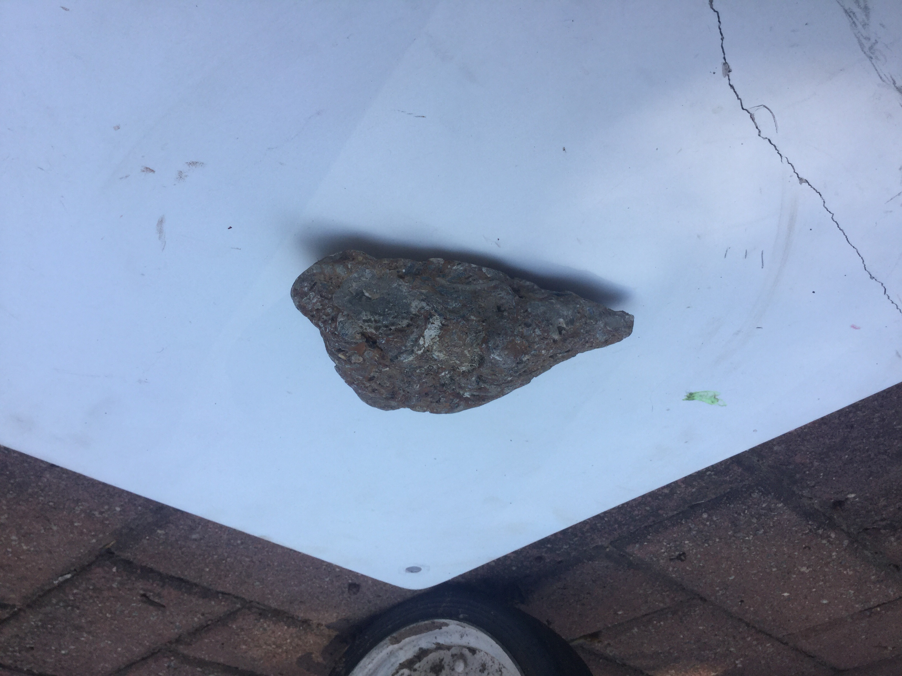
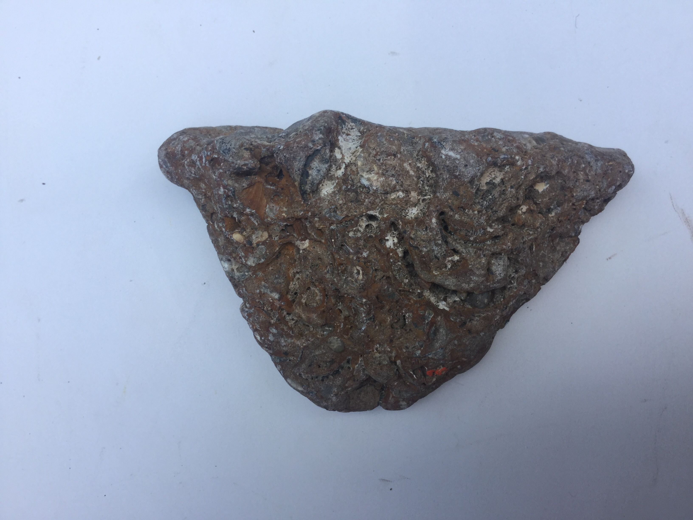
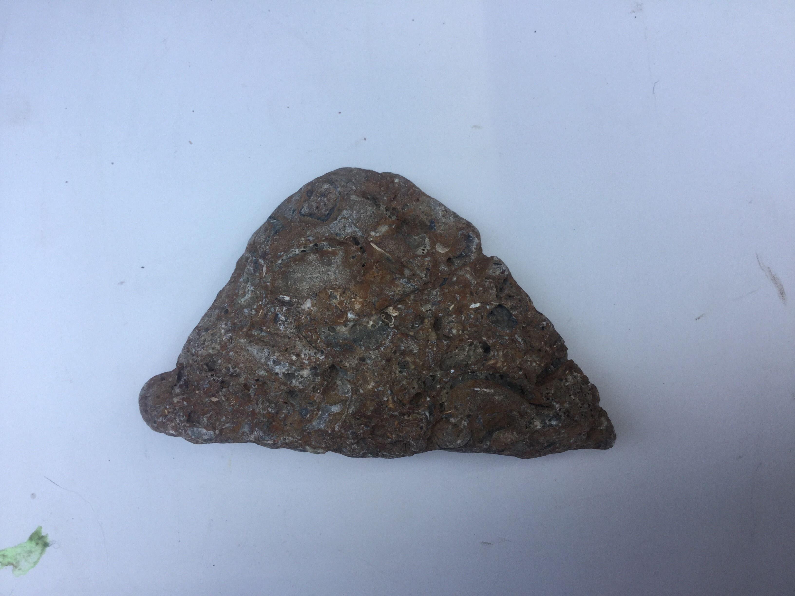

# Fossilized Sea Rock-2
I found it On holiday at the sea.
 

|       Field | Value                   |
|------------:|-------------------------|
|   **Title** | Fossilized Sea Rock-2 |
|     **Key** | ROCK-6 |
| **Created** | 27/Oct/18 11:32 AM |
| **Location Found** | Trafalgar, KWazulu-Natal 30/12/2019 |
| **Rock Type** | Sedementery |

        